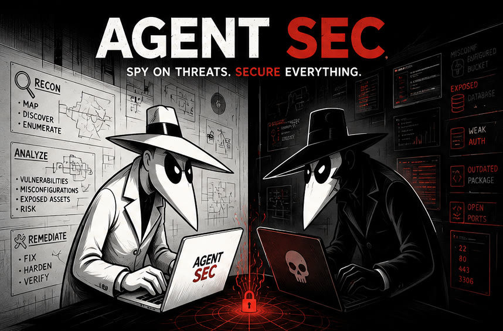

# Install AgentSec

[](https://github.com/0xcryptj/AgentSec/actions/workflows/agentsec-ci.yml) [](LICENSE)

The polished one-line installer installs AgentSec as a global skill for supported coding agents:

```bash
curl -fsSL --proto '=https' --tlsv1.2 https://raw.githubusercontent.com/0xcryptj/AgentSec/v1.2.1/install.sh | bash
```

Prefer to inspect the script first? Run it locally after cloning:

```bash
./install.sh
```

Or use the underlying skills CLI directly:

```bash
npx skills add 0xcryptj/AgentSec --skill agentsec --agent '*' -g -y
```

The wildcard target installs AgentSec across every agent supported by the `skills` CLI, including Codex, Claude Code, Cursor, Cline, Amp and other compatible coding agents. For one agent only, use its CLI identifier:

```bash
npx skills add 0xcryptj/AgentSec --skill agentsec --agent codex -g -y
npx skills add 0xcryptj/AgentSec --skill agentsec --agent claude-code -g -y
npx skills add 0xcryptj/AgentSec --skill agentsec --agent cursor -g -y
```

Then say:

```text
Use AgentSec to audit this project and propose the simplest safe fixes.
```

<p align="center">
  <a href="https://github.com/0xcryptj/AgentSec">
    
  </a>
</p>

<p align="center">
  
</p>

# AgentSec

**A senior security engineer for AI-built software.**

AgentSec is an Agent Skill for vibe-coded and AI-assisted projects. It helps your coding agent understand the repo, find meaningful security problems, check current threat intelligence, explain what matters, rewrite insecure code or configuration, and verify the fix.

## What it does

- Reads repositories progressively instead of wasting context on every file.
- Reviews code, authentication, authorization, dependencies, servers, CI/CD, cloud and edge configuration.
- Checks current package advisories and malware intelligence when network access is available.
- Finds vulnerable or malicious dependencies, secrets, exposed files, weak permissions, injection flaws and risky architecture.
- Tells the coding agent how the code or configuration should change.
- Verifies fixes with focused security checks and normal project tests when possible.

## KISS

**Keep It Simple, Stupid.**

AgentSec prefers security that people can understand, operate and maintain.

Secure defaults, least privilege, server-side authorization, standard cryptography, parameterized queries and small reviewable fixes beat unnecessary complexity.

Complexity is only worth adding when the reduction in risk justifies it.

## Standards

AgentSec is **standards-led and tool-assisted**.

Primary references:

- **OWASP ASVS 5.0.0** for application security requirements
- **OWASP Top 10:2025** for high-level application risk categories
- **OWASP WSTG** for web testing methodology
- **CWE** for weakness classification
- **CIS Benchmarks** for infrastructure and server hardening
- **NIST SSDF** for secure software-development practices

AgentSec can correlate evidence from tools such as **Burp Suite**, **SonarQube**, **Snyk**, Semgrep, Trivy, OSV-Scanner, Gitleaks, npm audit, ZAP, Nmap and others.

The standard defines what good looks like. The scanner provides evidence. AgentSec reasons about the actual architecture and root cause.

See [`references/standards-and-tools.md`](references/standards-and-tools.md).

## Try it

```text
Use AgentSec to audit this repo. Understand the architecture first, then find the highest-priority security issues and propose KISS fixes.
```

```text
Use AgentSec to review authentication and authorization. Check least privilege, MFA, sessions, admin access and tenant boundaries.
```

```text
Use AgentSec to check our dependencies for vulnerable or compromised packages and safely fix high-confidence issues.
```

```text
Use AgentSec to implement the safe high-priority fixes and retest them.
```

## Direct CLI

```bash
./agentsec repo .
./agentsec repo . --scan-mode deep
./agentsec server --local
./agentsec web https://staging.example.com --authorized
./agentsec web https://staging.example.com --authorized --baseline-only
./agentsec url https://staging.example.com --authorized
./agentsec --version
./agentsec update
```

Each audit preserves raw tool output and writes a machine-readable
`findings.json` review queue alongside `summary.json` and `summary.md` under
`.agentsec/reports/<run>/`. A non-zero scanner result remains explicitly
`review-needed` until the agent or a human correlates it with source and
runtime architecture. The same run also emits `findings.sarif` for GitHub Code
Scanning and other SARIF-compatible systems.

The included [security report workflow](.github/workflows/agentsec-security-report.yml)
publishes the report as a pull-request artifact and uploads SARIF to GitHub Code
Scanning when repository permissions allow it.

Open the latest report locally with the private viewer:

```bash
./agentsec view
./agentsec view --no-browser
./agentsec view --list
```

The viewer binds to `127.0.0.1`, uses a random token in the URL, serves only the
selected report run, and shuts down with `Ctrl-C`.

Website audit prompt:

```text
This is my website: https://example.com. Take a look at misconfigurations and perform an overall security audit. Look for vulnerabilities we can patch and hardening opportunities.
```

The agent should run a safe authorized baseline first, correlate results with the application source when available, separate patchable code issues from server/provider configuration, and ask before changing anything. Active validation remains opt-in with `--active`.

Web reports include structured observations for browser headers, CORS, cookies,
robots.txt, sitemap.xml, security.txt, common sensitive paths, technology/API
signals, and database items that cannot be verified from black-box traffic.
`--baseline-only` completes these bounded checks without waiting for optional
long-running surface scanners.

Active remote testing is explicit:

```bash
./agentsec web https://staging.example.com --authorized --active
```

Only test systems you own or have permission to assess.

## Advanced

AgentSec can reason about:

- SQL injection, XSS, SSRF, command injection, path traversal, CSRF and IDOR
- authentication, sessions, MFA, passkeys and step-up authentication
- database roles, service identities, cloud IAM and CI/CD least privilege
- vulnerable and malicious packages, install scripts and supply-chain incidents
- Linux servers, SSH, firewalls, Docker, web servers and exposed services
- Cloudflare WAF, rate limiting, Turnstile, origin protection and caching boundaries
- exposed directories, backups, dotfiles, logs, source maps and public assets
- architecture, trust boundaries, sensitive data and blast radius

AgentSec separates **confirmed vulnerabilities**, **security design gaps**, **security opportunities**, and items that **need review** so every observation does not become a red siren.

## Docs

- [`docs/QUICKSTART.md`](docs/QUICKSTART.md)
- [`docs/GETTING_STARTED.md`](docs/GETTING_STARTED.md)
- [`docs/INSTALLATION.md`](docs/INSTALLATION.md)
- [`docs/USAGE.md`](docs/USAGE.md)
- [`docs/ARCHITECTURE.md`](docs/ARCHITECTURE.md)
- [`docs/SECURITY_CONCEPTS.md`](docs/SECURITY_CONCEPTS.md)
- [`docs/FRESH_INTELLIGENCE.md`](docs/FRESH_INTELLIGENCE.md)
- [`docs/REMEDIATION_GUIDE.md`](docs/REMEDIATION_GUIDE.md)
- [`references/standards-and-tools.md`](references/standards-and-tools.md)
- [`CONTRIBUTING.md`](CONTRIBUTING.md)
- [`SECURITY.md`](SECURITY.md)
- [`CHANGELOG.md`](CHANGELOG.md)

<p align="center"><strong>Audit. Reason. Remediate. Verify.</strong></p>

## Support development

If AgentSec is useful to you, you can support its development and security research with crypto:

| Network | Address |
| --- | --- |
| Solana | `8iWkKbf3fzRJTDeN8Z2xCTAxNRW7P4by6esNL4MvLDNb` |
| Ethereum / EVM | `0xEcCD423fb879eBcDe42D50cB9B99AcF72cF8506a` |
| Bitcoin | `bc1qq8q6s485m73vzq62ucl6v48t36fuf0t5q2ly2r` |
| Monero | `868iJ8XTJpaYcyGTAs5hqPWvKBszDF11ERoYZg2NRU8PBogEjMecU6Q5USCgrJbDXHUNfxFrq3m5PAUaFwnKXU5WJxM8krP` |

Always verify the network and address before sending funds.
