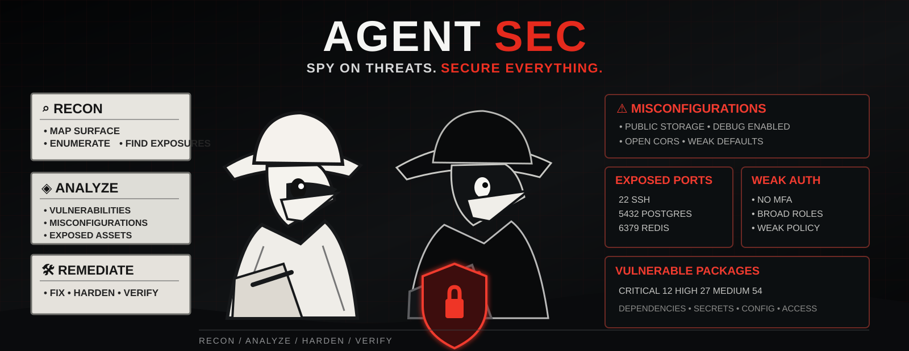

<p align="center">
  
</p>

<h1 align="center">AgentSec</h1>
<p align="center"><strong>Security for AI-powered development.</strong></p>

<p align="center">
  AgentSec gives AI coding agents a security brain. It checks your code, apps, packages, and servers, points out weak spots, suggests better protection, and helps fix what it finds.
</p>

<p align="center">
  <a href="docs/GETTING_STARTED.md">Docs</a> ·
  <a href="docs/QUICKSTART.md">Quick Start</a> ·
  <a href="#features">Features</a> ·
  <a href="docs/INSTALLATION.md">Installation</a> ·
  <a href="docs/USAGE.md">Usage</a> ·
  <a href="#advanced">Advanced</a> ·
  <a href="CONTRIBUTING.md">Contributing</a>
</p>

<p align="center">
  
  
  <a href="https://github.com/0xcryptj/AgentSec/actions/workflows/agentsec-ci.yml"></a>
  
  
</p>

> [!IMPORTANT]
> AgentSec is for defensive development and authorized security assessment. Only scan systems you own or have permission to test.

---

## Features

<table>
<tr>
<td width="50%" valign="top">

### 🔍 Deep Audits
Review apps, source code, servers, networks, cloud setups, and dependencies from one security workflow.

### 📦 Package Safety
Find vulnerable or suspicious packages and help choose safer upgrades without blindly breaking the project.

### 🔐 Secrets & Exposure
Look for leaked credentials, exposed files, backups, public directories, risky services, and other things that should not be reachable.

### 🧠 Security Architecture
Understand how the project is built before recommending changes, instead of throwing generic scanner warnings at it.

</td>
<td width="50%" valign="top">

### 🛡️ Smarter Protection
Suggest practical improvements such as least privilege, stronger login protection, safer permissions, rate limits, and better separation between services.

### 🛠️ Guided Fixes
Help make conservative code and configuration changes, then verify the relevant security issue again.

### ☁️ Cloud & Edge Review
Recognize infrastructure such as Cloudflare and suggest useful protections already available in the stack.

### 🤖 Built for Agents
Use the same AgentSec skill with Claude Code, Codex, Cursor, GitHub Copilot, and other Agent Skills-compatible clients.

</td>
</tr>
</table>

---

## 🚀 Quick Start

### Give AgentSec to your coding agents

```bash
npx skills add 0xcryptj/AgentSec --skill agentsec --agent '*' -g -y
```

Then ask your agent things like:

```text
Use AgentSec to audit this project and explain the biggest security risks.
```

```text
Use AgentSec to review this repo, suggest fixes, and safely implement the high-confidence ones.
```

### Run AgentSec directly

```bash
./agentsec repo .
```

```bash
./agentsec server --local
```

```bash
./agentsec web https://staging.example.com --authorized
```

---

## How AgentSec Thinks

```text
DISCOVER  ->  UNDERSTAND  ->  AUDIT  ->  VERIFY  ->  FIX  ->  RETEST
```

A normal scanner might say that a port is open or a package has a vulnerability. AgentSec is designed to ask the next question: **why is it exposed, what could happen, what is the safest fix, and how do we prove the fix worked?**

<table>
<tr>
<td width="33%" align="center"><strong>🔍 AUDIT</strong><br><br>Find weak spots and exposed surfaces.</td>
<td width="33%" align="center"><strong>🕵️ REASON</strong><br><br>Understand architecture and real-world risk.</td>
<td width="33%" align="center"><strong>🛡️ REMEDIATE</strong><br><br>Fix root causes and verify the result.</td>
</tr>
</table>

---

## Advanced

This is where AgentSec gets more technical. The skill can reason across the application, host, dependency, identity, and infrastructure layers instead of treating them as separate checklists.

<table>
<tr>
<td width="50%" valign="top">

### Application security
- SQL injection and unsafe database access
- XSS and output encoding
- SSRF and unsafe outbound requests
- command injection and path traversal
- CSRF, IDOR, broken authorization, and session weaknesses
- unsafe uploads, insecure crypto, and secret handling

### Supply chain
- `npm audit` and dependency-tree analysis
- npm package signature checks when supported
- lockfile integrity and suspicious dependency changes
- install and postinstall scripts
- OSV-Scanner, Trivy, pip-audit, cargo-audit, and related tools
- response steps for confirmed malicious or compromised packages

### Server security
- patch state and vulnerable services
- SSH and firewall policy
- listening ports and database/cache exposure
- SUID/SGID and sensitive permissions
- systemd and cron surfaces
- Docker privileges and socket exposure
- Nginx/Apache document-root and configuration review

</td>
<td width="50%" valign="top">

### Architecture & least privilege
- trust boundaries and data flows
- runtime vs migration database identities
- worker and service-account permissions
- CI/CD token scope
- cloud IAM and API/OAuth scopes
- tenant isolation and privileged operations

### Identity
- MFA, passkeys, and WebAuthn opportunities
- step-up authentication for high-impact actions
- session lifetime and recovery-flow review
- privileged account separation
- external IdP controls marked as review-needed when they cannot be verified from source

### Cloudflare & edge
- managed WAF opportunities
- route-specific rate limits
- Turnstile and abuse-sensitive forms
- Full (strict) TLS
- origin lockdown and Authenticated Origin Pulls where appropriate
- cache bypass for personalized or authorization-sensitive responses

### Exposure testing
- Nmap service discovery
- Gobuster and ffuf path discovery
- Nikto and ZAP baseline checks
- controlled active web validation only with explicit authorization

</td>
</tr>
</table>

### Finding quality

AgentSec separates findings into four classes so everything does not become a red alert:

| Class | Meaning |
| --- | --- |
| **Confirmed vulnerability** | Evidence shows an unsafe condition. |
| **Security design gap** | The architecture has a concrete weakness or missing control. |
| **Security opportunity** | A defense-in-depth improvement would reduce risk. |
| **Review needed** | The repo suggests a possible issue, but runtime or provider configuration must be checked. |

`robots.txt` and `llms.txt` are treated as crawler/discoverability files, not access control. `security.txt` is treated as a useful disclosure and operational-security control.

---

## 📖 Documentation

<table>
<tr>
<td width="50%" valign="top">

📘 <a href="docs/GETTING_STARTED.md"><strong>GETTING_STARTED.md</strong></a> - overview and first audit<br><br>
⚡ <a href="docs/QUICKSTART.md"><strong>QUICKSTART.md</strong></a> - fastest setup path<br><br>
📦 <a href="docs/INSTALLATION.md"><strong>INSTALLATION.md</strong></a> - installation and requirements<br><br>
⌨️ <a href="docs/USAGE.md"><strong>USAGE.md</strong></a> - commands, modes, and examples

</td>
<td width="50%" valign="top">

🏗️ <a href="docs/ARCHITECTURE.md"><strong>ARCHITECTURE.md</strong></a> - how AgentSec works<br><br>
🔐 <a href="docs/SECURITY_CONCEPTS.md"><strong>SECURITY_CONCEPTS.md</strong></a> - deeper security concepts<br><br>
🛠️ <a href="docs/REMEDIATION_GUIDE.md"><strong>REMEDIATION_GUIDE.md</strong></a> - fixes and verification<br><br>
🧪 <a href="docs/DEVELOPMENT.md"><strong>DEVELOPMENT.md</strong></a> - contributing and extending

</td>
</tr>
</table>

---

## Reports

AgentSec stores audit evidence under:

```text
.agentsec/reports/<scope>-<timestamp>/
```

Raw scanner output and summaries are kept together so both humans and agents can see what actually happened. Generated audit output is gitignored because it may contain sensitive information.

---

## Project Layout

```text
AgentSec/
├── SKILL.md
├── agentsec
├── scripts/
├── references/
├── docs/
├── tests/
├── SECURITY.md
└── CONTRIBUTING.md
```

Read [SECURITY.md](SECURITY.md) for the disclosure policy and [CONTRIBUTING.md](CONTRIBUTING.md) to contribute.

<p align="center"><strong>Audit. Reason. Remediate. Verify.</strong></p>
