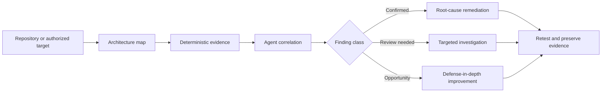

<div align="center">


# Agent<span style="color:#ef2b20">Sec</span>

### Security for AI-built software.

<p>
  <strong>Audit</strong>&nbsp;&nbsp;·&nbsp;&nbsp;
  <strong>Reason</strong>&nbsp;&nbsp;·&nbsp;&nbsp;
  <strong>Remediate</strong>&nbsp;&nbsp;·&nbsp;&nbsp;
  <strong>Verify</strong>
</p>

<p>
  <a href="https://github.com/0xcryptj/AgentSec/actions/workflows/agentsec-ci.yml"></a>
  <a href="LICENSE"></a>
  <a href="VERSION"></a>
  <a href="docs/CAPABILITIES.md"></a>
</p>

<p>
  An agent skill and deterministic CLI that helps coding agents understand architecture,
  find meaningful security problems, apply safe fixes, and verify the result.
</p>

</div>

<p align="center">
  
</p>

## Why AgentSec

AI-built software moves quickly. Security review should keep up without becoming
noise.

AgentSec combines progressive security guidance with deterministic evidence
collection. It gives an agent enough architecture context to reason about risk,
keeps scanner output explainable, and preserves the raw evidence needed to
verify a fix.

| Understand | Find | Fix | Prove |
| --- | --- | --- | --- |
| Architecture, trust boundaries, identities, and sensitive assets | Dependencies, secrets, misconfigurations, exposed surfaces, and risky source patterns | Root-cause code, configuration, dependency, and hardening changes | Focused regression checks, normalized findings, SARIF, and preserved evidence |

## Start in 60 seconds

Install AgentSec as a skill for your coding agent:

```bash
npx skills add 0xcryptj/AgentSec --skill agentsec --agent '*' -g -y
```

Then ask your agent:

```text
Use AgentSec to audit this project, explain the highest-priority risks,
and propose the simplest safe fixes.
```

Or run the bundled CLI directly:

```bash
./agentsec repo .
```

## A security workflow, not scanner noise



AgentSec deliberately separates:

- **Confirmed vulnerabilities** — evidence demonstrates an unsafe condition.
- **Security design gaps** — architecture shows a weak or missing control.
- **Security opportunities** — useful hardening or resilience improvements.
- **Review-needed items** — signals that require source, runtime, or provider correlation.

Scanner output is evidence, not a verdict.

## What it covers

### Repository and supply chain

Architecture inventory, source-security patterns, dependency advisories, npm
signatures, optional OSV/Trivy/Semgrep/Gitleaks/pip-audit/cargo-audit checks,
sensitive-artifact discovery, and current package intelligence.

### Web and API surfaces

Authorized passive web baselines, headers, cookies, CORS, security.txt,
robots/sitemap, bounded exposure checks, TLS/service evidence, OpenAPI inventory,
and carefully gated active validation.

### Servers and deployment

Local Linux hardening, SSH and firewall evidence, listening services, Docker and
web-root checks, reverse-proxy concerns, Cloudflare-aware guidance, and least
privilege review.

### Agent-ready capability library

The modular playbooks under [`skills/`](skills/) provide progressive discovery,
framework context, workflows, and verification criteria:

| Capability | Focus |
| --- | --- |
| `repository-security-review` | Source, dependencies, secrets, and architecture |
| `web-application-baseline` | Authorized passive web assessment |
| `api-contract-review` | OpenAPI inventory and bounded probes |
| `server-hardening-review` | Host and service exposure |
| `remediation-and-verification` | Root-cause fixes and retesting |

Browse or search them from the CLI:

```bash
./agentsec capabilities
./agentsec capabilities web
```

## CLI at a glance

```bash
# Repository audit profiles
./agentsec repo . --scan-mode quick
./agentsec repo . --scan-mode standard
./agentsec repo . --scan-mode deep

# Authorized web and API review
./agentsec web https://staging.example.com --authorized --baseline-only
./agentsec api ./openapi.json

# Host review and multi-target orchestration
./agentsec server --local
./agentsec scan --target ./app --target https://staging.example.com --authorized

# Reports, capabilities, and maintenance
./agentsec view
./agentsec capabilities security
./agentsec --version
./agentsec update
```

Remote targets require `--authorized`. Active web validation additionally
requires `--active`; it is never implied by a URL.

## Reports you can trust and inspect

Every audit run preserves a machine-readable and human-readable trail under:

```text
.agentsec/reports/<run>/
├── summary.md              # executive-readable result
├── summary.json            # machine-readable metadata
├── findings.json           # normalized review queue
├── findings.sarif          # GitHub Code Scanning compatible output
├── vulnerabilities.*       # normalized vulnerability exports when applicable
├── run.json                # run metadata
├── events.jsonl            # append-only execution events
└── <raw evidence>          # original scanner and probe output
```

Open the latest report locally:

```bash
./agentsec view
```

The viewer binds to loopback, uses a random token, serves only the selected run,
escapes report content, and shuts down with `Ctrl-C`.

## Architecture

```text
SKILL.md                  Portable agent behavior and safety boundary
references/               Progressive security knowledge
skills/                   Modular capability playbooks and catalog
mappings/                 Framework interpretation metadata
scripts/                  Deterministic evidence collection
tools/                    Capability validation and index generation
tests/                    Regression and false-positive tests
docs/                     Human-facing guides and CLI reference
.github/workflows/        CI, security reports, and capability validation
```

The core design principle is simple: agents reason about architecture and risk;
deterministic tools collect and preserve evidence.

## Documentation

- [Quick Start](docs/QUICKSTART.md)
- [CLI Reference](docs/CLI_REFERENCE.md)
- [Capabilities](docs/CAPABILITIES.md)
- [Architecture](docs/ARCHITECTURE.md)
- [Usage](docs/USAGE.md)
- [Installation](docs/INSTALLATION.md)
- [Development](docs/DEVELOPMENT.md)
- [Remediation Guide](docs/REMEDIATION_GUIDE.md)
- [Security Policy](SECURITY.md)
- [Contributing](CONTRIBUTING.md)

## Development

Run the complete local quality gate:

```bash
make check
```

AgentSec is MIT-licensed. See [`CITATION.cff`](CITATION.cff) for citation
metadata and [`CODE_OF_CONDUCT.md`](CODE_OF_CONDUCT.md) for community standards.

<div align="center">

**Audit. Reason. Remediate. Verify.**

</div>
